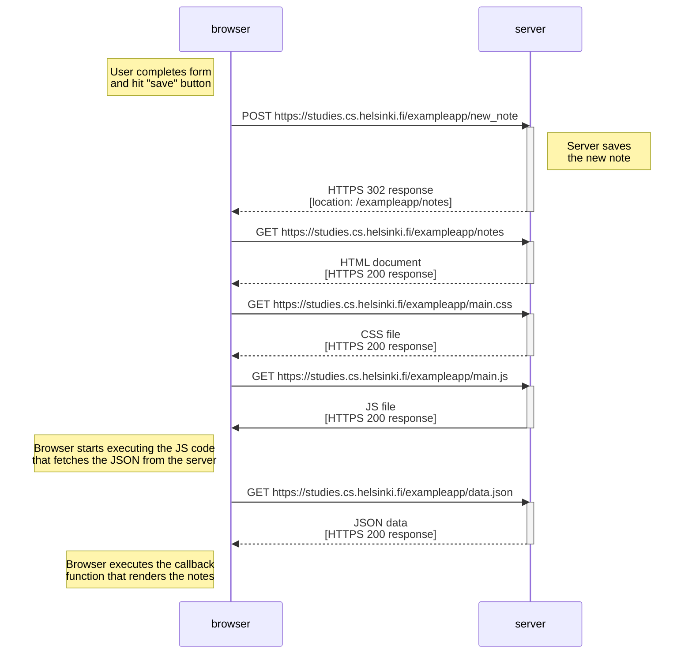

```mermaid
sequenceDiagram
    participant browser
    participant server

    note left of browser: User completes form<br/>and hit "save" button
    browser->>server: POST https://studies.cs.helsinki.fi/exampleapp/new_note
    activate server
    note right of server: Server saves<br/>the new note 
    server-->>browser: HTTPS 302 response<br/>[location: /exampleapp/notes]
    deactivate server

    browser->>server: GET https://studies.cs.helsinki.fi/exampleapp/notes
    activate server
    server-->>browser: HTML  document<br/>[HTTPS 200 response]
    deactivate server

    browser->>server: GET https://studies.cs.helsinki.fi/exampleapp/main.css
    activate server
    server-->>browser: CSS file<br/>[HTTPS 200 response]
    deactivate server

    browser->>server: GET https://studies.cs.helsinki.fi/exampleapp/main.js
    activate server
    server->>browser: JS file<br/>[HTTPS 200 response]
    deactivate server

    note left of browser: Browser starts executing the JS code<br/>that fetches the JSON from the server
    browser->>server: GET https://studies.cs.helsinki.fi/exampleapp/data.json
    activate server
    server-->>browser: JSON data<br/>[HTTPS 200 response]
    deactivate server

    note left of browser: Browser executes the callback<br/>function that renders the notes
```
