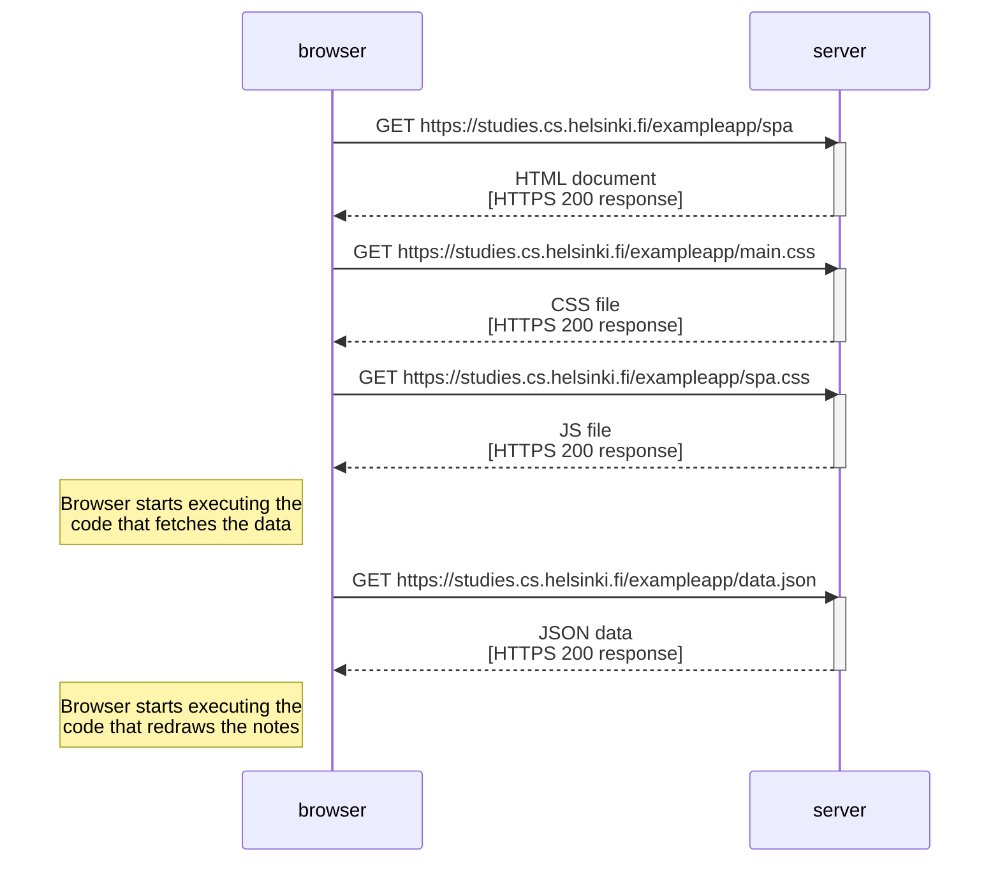

```mermaid
sequenceDiagram
    participant browser
    participant server

    browser->>server: GET https://studies.cs.helsinki.fi/exampleapp/spa
    activate server
    server-->>browser: HTML document<br/>[HTTPS 200 response]
    deactivate server

    browser->>server: GET https://studies.cs.helsinki.fi/exampleapp/main.css
    activate server
    server-->>browser: CSS file<br/>[HTTPS 200 response]
    deactivate server

    browser->>server: GET https://studies.cs.helsinki.fi/exampleapp/spa.css
    activate server
    server-->>browser: JS file<br/>[HTTPS 200 response]
    deactivate server

    note left of browser: Browser starts executing the<br/>code that fetches the data

    browser->>server: GET https://studies.cs.helsinki.fi/exampleapp/data.json
    activate server
    server-->>browser: JSON data<br/>[HTTPS 200 response]
    deactivate server

    note left of browser: Browser starts executing the<br/>code that redraws the notes
```
