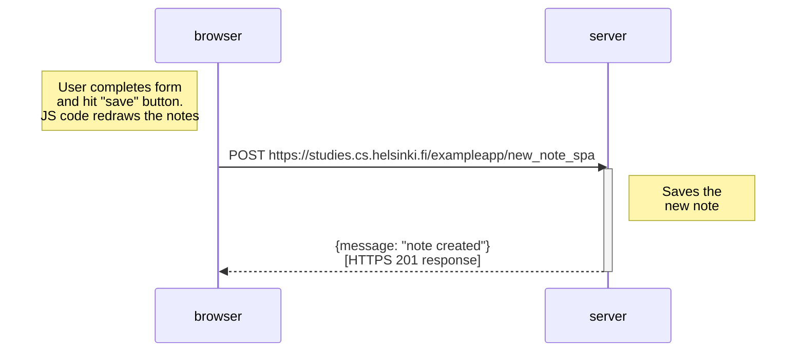

```mermaid
sequenceDiagram
    participant browser
    participant server

    note left of browser: User completes form<br/>and hit "save" button.<br/>JS code redraws the notes
    browser->>server: POST https://studies.cs.helsinki.fi/exampleapp/new_note_spa
    activate server
    note right of server: Saves the<br/>new note
    server-->>browser: {message: "note created"}<br/>[HTTPS 201 response]
    deactivate server
```
